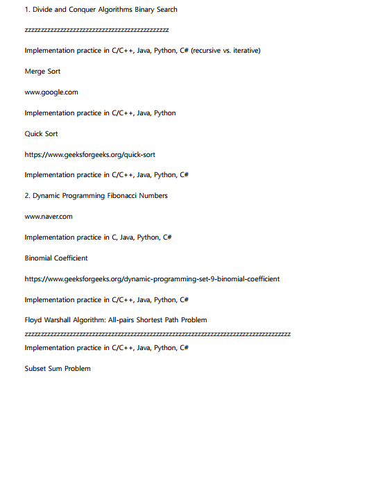
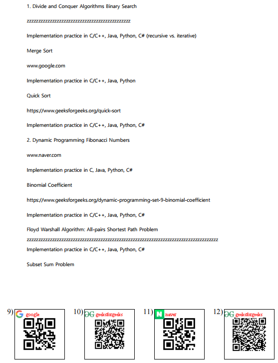
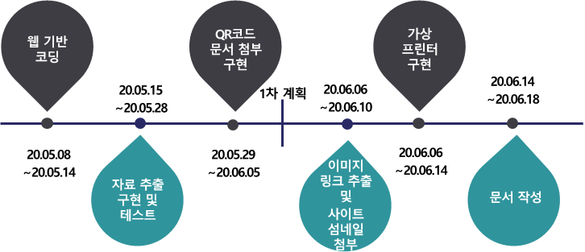

# QRdoc

#### 	빠르고, 편하게, 깔끔하게 QR-code를 문서에 넣어주는 프로그램.** 

1. QRdoc을 사용하면, 문서 안 모든 링크를 일일이 QR-code로 변환하지 않아도 됩니다.  

   **클릭 한 번으로 문서 안 모든 링크 주소를 QR-code로 만들어줍니다.** 

 1. QRdoc을 사용하면, 문서를 읽는 사람이 링크주소를 직접 인터넷 주소창에 타이핑 하지 않아도 됩니다. 

     **QR-code로 손쉽게 해당 사이트에 접속할 수 있습니다.** 

 3. QRdoc을 사용하면, 여러 pdf 문서를 한 번에 관리할 수 있습니다. 

    **클릭 한 번으로  여러 pdf 파일 안에 QR-code를 첨부할 수 있습니다.**

## 프로젝트 소개

▷팀 번호:                 9

▷팀 참가자:            김민주,  석제노, 유현욱, 조성찬

▷프로그램 기능:     문서 안 링크 주소를 자동으로 QR-code로 변환해서 문서 안에 첨부한다.

## 사용 예시:			

전                                                                             ->            후

## 기능 소개

#### MVP(minimum viable product)의 기능

1. **정규식** 을 사용하여, PDF 문서에서 링크 주소를  추출한다.

2. 링크를 **QR-code**로 변환한다. (Zxing 라이브러리 사용)

3. PDF 문서에 QR-code를 **삽입**한다. (pdfbox 라이브러리 사용)

   

#### 추가로 구현할 기능

1. PDF 문서 안 **하이퍼링크**를 찾아서, 그에 맞는 QR-code를 문서에 넣어준다.

2. **favicon**을 QR-code의 배경으로 하는 **Visual QR-code**를 만든다. 

   ex) https://github.com/rakib434/pdf           =>          

   *// 파비콘(영어: favicon, 'favorites + icon') 또는 패비콘이란 인터넷 웹 브라우저의 주소창에 표시되는 웹사이트나 웹페이지를 대표하는 아이콘이다.* 

   출처: [위키백과](https://ko.wikipedia.org/wiki/파비콘)

3. **가상 프린터**를 사용해서, 한글 파일 또는 워드 파일을 pdf로 PDF 파일로 바꿔준다. 

   그 다음 PDF 파일 안 링크를 QR-code로 바꿔서 문서에 넣어준다.

   *// 가상 프린터는 소프트웨어적인 가상의 프린터 하드웨어 장치, 즉 에뮬레이터이다. 실제프린터를 통해 출력물을 종이로 인쇄하는것이 아닌 PDF 파일이나 TIFF 등 컴퓨터파일로 출력하는 가상의 PDF프린터도 여기에 포함된다.*

   출처: [위키백과](https://ko.wikipedia.org/wiki/%EA%B0%80%EC%83%81_%ED%94%84%EB%A6%B0%ED%84%B0)

## 활용 라이브러리

1. [zxing](https://github.com/zxing/zxing)

2. [pdfbox](https://github.com/apache/pdfbox)

## 라이선스

QRdoc is licensed under the Apache License, Version 2.0. See [LICENSE](https://github.com/JoeSeongchan/QRdoc/blob/master/LICENSE) for full license text.

## 개발 계획

## 작성자
조성찬

